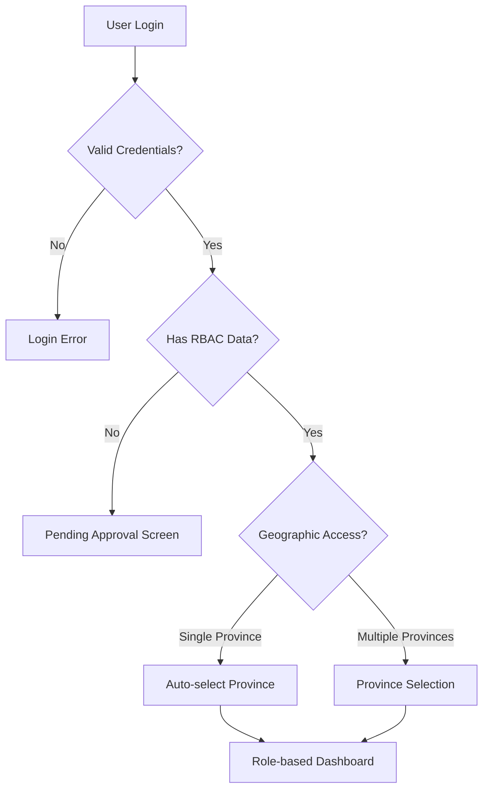

# KBN Clean Slate RBAC Redesign - Application Flow

**Project**: KBN Multi-Province RBAC System  
**Document**: 04 - Application Flow  
**Created**: December 2024  
**Purpose**: Complete user journey and application flow documentation

---

## 🎯 **OVERVIEW**

This document maps out the complete user journey through the KBN application, from login to daily operations, highlighting how RBAC controls access and shapes the user experience across different roles and geographic contexts.

---

## 🚪 **LOGIN & AUTHENTICATION FLOW**

### **1. Initial Login**

```
User Access → Authentication Check → Role Assignment → Geographic Context → Dashboard Routing
```

#### Authentication States

```javascript
const authenticationStates = {
  UNAUTHENTICATED: {
    action: "Redirect to login",
    allowedRoutes: ["/login", "/signup", "/forgot-password"],
  },

  AUTHENTICATED_NO_RBAC: {
    action: "Show role assignment pending",
    allowedRoutes: ["/pending-approval"],
  },

  AUTHENTICATED_WITH_RBAC: {
    action: "Route to appropriate dashboard",
    allowedRoutes: "Based on user permissions",
  },
};
```

#### Login Process Flow



---

## 🏠 **DASHBOARD ROUTING**

### **Permission-Based Dashboard Selection**

```javascript
const getDashboardRoute = (userPermissions, geographic) => {
  // Route based on primary permissions rather than fixed roles
  if (userPermissions.includes("admin.system")) {
    return "/overview/admin-dashboard";
  } else if (userPermissions.includes("reports.cross-province")) {
    return "/overview/executive-dashboard";
  } else if (userPermissions.some((p) => p.startsWith("province."))) {
    return "/overview/province-dashboard";
  } else if (userPermissions.some((p) => p.startsWith("branch."))) {
    return "/overview/branch-dashboard";
  } else if (userPermissions.some((p) => p.startsWith("accounting."))) {
    return "/overview/accounting-dashboard";
  } else if (userPermissions.some((p) => p.startsWith("sales."))) {
    return "/overview/sales-dashboard";
  } else if (userPermissions.some((p) => p.startsWith("service."))) {
    return "/overview/service-dashboard";
  } else if (userPermissions.some((p) => p.startsWith("inventory."))) {
    return "/overview/inventory-dashboard";
  }

  // Default dashboard
  return "/overview/default-dashboard";
};
```

### **Dashboard Content by Permission Level**

```javascript
// Admin Dashboard - for users with admin.system permission
const AdminDashboard = () => (
  <div>
    <SystemOverview />
    <CrossProvinceMetrics />
    <UserManagement />
    <SystemSettings />
  </div>
);

// Province Dashboard - for users with province-level permissions
const ProvinceDashboard = ({ provinceId }) => (
  <div>
    <ProvinceOverview provinceId={provinceId} />
    <BranchPerformance provinceId={provinceId} />
    <StaffManagement provinceId={provinceId} />
    <ProvinceReports provinceId={provinceId} />
  </div>
);

// Department Dashboard - for users with department-specific permissions
const DepartmentDashboard = ({ branchCode, primaryDepartment }) => (
  <div>
    <BranchOverview branchCode={branchCode} />
    <DepartmentTasks department={primaryDepartment} />
    <RecentActivities branchCode={branchCode} />
    <QuickActions department={primaryDepartment} />
  </div>
);
```

---

## 🧭 **NAVIGATION FLOW**

### **Menu Structure by Permission Groups**

```javascript
const generateNavigationByPermissions = (userPermissions) => {
  const navigation = [];

  // Add sections based on user's permissions
  if (userPermissions.some((p) => p.startsWith("admin."))) {
    navigation.push({
      section: "Administration",
      items: [
        { title: "System Dashboard", permission: "admin.system" },
        { title: "User Management", permission: "admin.users" },
        { title: "System Settings", permission: "admin.settings" },
      ],
    });
  }

  if (userPermissions.some((p) => p.startsWith("accounting."))) {
    navigation.push({
      section: "Accounting",
      items: [
        { title: "Income Daily", permission: "accounting.view" },
        { title: "Expenses", permission: "accounting.view" },
        { title: "Reports", permission: "accounting.reports" },
      ],
    });
  }

  if (userPermissions.some((p) => p.startsWith("sales."))) {
    navigation.push({
      section: "Sales",
      items: [
        { title: "Vehicle Booking", permission: "sales.view" },
        { title: "Parts Sales", permission: "sales.view" },
        { title: "Customer Management", permission: "sales.customers" },
      ],
    });
  }

  if (userPermissions.some((p) => p.startsWith("service."))) {
    navigation.push({
      section: "Service",
      items: [
        { title: "Service Orders", permission: "service.view" },
        { title: "Maintenance", permission: "service.manage" },
      ],
    });
  }

  if (userPermissions.some((p) => p.startsWith("inventory."))) {
    navigation.push({
      section: "Inventory",
      items: [
        { title: "Stock Management", permission: "inventory.view" },
        { title: "Import/Export", permission: "inventory.manage" },
      ],
    });
  }

  return navigation;
};
```

### **Dynamic Menu Filtering**

```javascript
const useNavigationFilter = () => {
  const { hasPermission } = usePermissions();

  const filterNavigationItems = (menuStructure) => {
    return menuStructure
      .map((section) => ({
        ...section,
        items: section.items.filter((item) => {
          const permission = getItemPermission(item);
          return hasPermission(permission);
        }),
      }))
      .filter((section) => section.items.length > 0);
  };

  return { filterNavigationItems };
};
```

---

## 📋 **BUSINESS OPERATION FLOWS**

### **1. Income Daily Entry Flow**

```
Access Check → Branch Selection → Form Entry → Geographic Enhancement → Validation → Audit Trail → Save
```

#### Flow Implementation

```javascript
const IncomeDailyFlow = () => {
  // 1. Access Check
  return (
    <LayoutWithRBAC
      permission="accounting.view"
      editPermission="accounting.edit"
    >
      {/* 2. Branch Selection (automatic via LayoutWithRBAC) */}
      <IncomeDailyForm />
    </LayoutWithRBAC>
  );
};

const IncomeDailyForm = ({ geographic, auditTrail }) => {
  const handleSubmit = async (formData) => {
    // 3. Geographic Enhancement
    const enhancedData = geographic.enhanceDataForSubmission(formData);

    // 4. Validation (business rules)
    const validationResult = validateIncomeData(enhancedData);
    if (!validationResult.valid) {
      throw new Error(validationResult.message);
    }

    // 5. Audit Trail & Save
    await auditTrail.saveWithAuditTrail({
      collection: "sections/account/incomes",
      data: enhancedData,
      notes: "Income daily entry",
    });
  };
};
```

### **2. Vehicle Sales Booking Flow**

```
Access Check → Customer Selection → Vehicle Selection → Pricing → Geographic Context → Approval Workflow → Documentation
```

#### Flow States

```javascript
const BookingFlowStates = {
  DRAFT: {
    permissions: ["sales.view"],
    actions: ["edit", "save-draft"],
    nextStates: ["PENDING_REVIEW"],
  },

  PENDING_REVIEW: {
    permissions: ["sales.review"],
    actions: ["approve", "reject", "request-changes"],
    nextStates: ["APPROVED", "REJECTED", "DRAFT"],
  },

  APPROVED: {
    permissions: ["sales.finalize"],
    actions: ["generate-documents", "schedule-delivery"],
    nextStates: ["FINALIZED"],
  },
};
```

### **3. Service Order Processing Flow**

```
Customer Arrival → Service Assessment → Parts Requirement → Labor Estimation → Authorization → Work Execution → Quality Check → Customer Delivery
```

#### Service Flow with RBAC

```javascript
const ServiceOrderFlow = ({ serviceId }) => {
  const { hasPermission } = usePermissions();

  return (
    <LayoutWithRBAC
      permission="service.view"
      editPermission="service.edit"
      documentId={serviceId}
      documentType="service_order"
      showAuditTrail={true}
    >
      <ServiceSteps>
        <Step1_Assessment enabled={hasPermission("service.assess")} />
        <Step2_PartsRequirement enabled={hasPermission("inventory.view")} />
        <Step3_LaborEstimation enabled={hasPermission("service.estimate")} />
        <Step4_Authorization enabled={hasPermission("service.authorize")} />
        <Step5_WorkExecution enabled={hasPermission("service.execute")} />
        <Step6_QualityCheck enabled={hasPermission("service.quality")} />
        <Step7_Delivery enabled={hasPermission("service.complete")} />
      </ServiceSteps>
    </LayoutWithRBAC>
  );
};
```

---

## 📊 **REPORTING FLOWS**

### **1. Financial Reports Access**

```
Permission Check → Province Selection → Date Range → Report Generation → Data Filtering → Export Options
```

#### Report Access by Permissions

```javascript
const reportAccessMatrix = {
  "Daily Income Summary": {
    requiredPermission: "accounting.view",
    geographicScope: "branch",
    description: "Available to users with accounting permissions",
  },

  "Cross-Province Analysis": {
    requiredPermission: "reports.cross-province",
    geographicScope: "multi-province",
    description: "Available to users with cross-province access permissions",
  },

  "Branch Performance": {
    requiredPermission: "reports.branch-performance",
    geographicScope: "province",
    description: "Available to users with branch performance permissions",
  },

  "Department Reports": {
    requiredPermission: "reports.department",
    geographicScope: "branch",
    description: "Available based on user's department permissions",
  },
};
```

### **2. Geographic Report Filtering**

```javascript
const GeographicReportFlow = () => {
  const { userProvinces, userBranches } = usePermissions();

  const generateReport = async (reportType, filters) => {
    // 1. Apply user's geographic constraints
    const constrainedFilters = {
      ...filters,
      provinces: filters.provinces.filter((p) => userProvinces.includes(p)),
      branches: filters.branches.filter((b) => userBranches.includes(b)),
    };

    // 2. Generate report with constrained data
    return await reportService.generate(reportType, constrainedFilters);
  };
};
```

---

## 🔄 **STATE MANAGEMENT FLOW**

### **1. Application State Structure**

```javascript
const applicationState = {
  auth: {
    user: { uid, email, displayName },
    isAuthenticated: boolean,
    loading: boolean,
  },

  rbac: {
    permissions: array,
    authority: string, // 'admin', 'province', 'branch', 'department'
    geographic: {
      allowedProvinces: array,
      allowedBranches: array,
      selectedProvince: string,
      selectedBranch: string,
    },
  },

  ui: {
    currentRoute: string,
    selectedBranch: string,
    loading: object,
    notifications: array,
  },

  businessData: {
    // Province-scoped data
    [provinceId]: {
      incomes: array,
      expenses: array,
      sales: array,
      inventory: array,
    },
  },
};
```

### **2. State Flow Patterns**

```javascript
// Login Flow
dispatch(authActions.loginStart());
const authResult = await firebase
  .auth()
  .signInWithEmailAndPassword(email, password);
dispatch(authActions.loginSuccess(authResult.user));
dispatch(rbacActions.loadUserRBAC(authResult.user.uid));

// Branch Selection Flow
dispatch(uiActions.setBranchSelection(branchCode));
dispatch(rbacActions.updateGeographicContext({ selectedBranch: branchCode }));
await dispatch(dataActions.loadBranchData(branchCode));

// Permission Check Flow
const hasAccess = useSelector((state) =>
  rbacSelectors.hasPermission(state, "accounting.view")
);
```

---

## 🚦 **ERROR HANDLING FLOWS**

### **1. Permission Denied Flow**

```javascript
const PermissionDeniedFlow = {
  INSUFFICIENT_PERMISSION: {
    trigger: "User lacks required permission",
    action: "Show permission denied message",
    recovery: "Redirect to accessible page",
  },

  GEOGRAPHIC_ACCESS_DENIED: {
    trigger: "User accessing unauthorized province/branch",
    action: "Show geographic access denied",
    recovery: "Redirect to user's home province",
  },

  SESSION_EXPIRED: {
    trigger: "Authentication token expired",
    action: "Clear session data",
    recovery: "Redirect to login",
  },
};
```

### **2. Data Access Error Flow**

```javascript
const DataAccessErrorFlow = () => {
  try {
    const data = await fetchBusinessData(filters);
    return filterDataByUserAccess(data);
  } catch (error) {
    if (error.code === 'permission-denied') {
      // Log security incident
      auditLogger.logSecurityEvent({
        type: 'UNAUTHORIZED_DATA_ACCESS',
        userId: user.uid,
        attemptedResource: filters,
        timestamp: Date.now()
      });

      // Show user-friendly error
      showNotification('Access denied to requested data', 'error');

      // Redirect to safe page
      history.push('/overview');
    }
  }
};
```

---

## 📱 **MOBILE FLOW CONSIDERATIONS**

### **1. Responsive Navigation**

```javascript
const MobileNavigation = () => {
  const { isMobile } = useResponsive();
  const navigation = useNavigationFilter();

  if (isMobile) {
    return (
      <MobileDrawer>
        <CollapsedNavigationMenu items={navigation.filtered} />
      </MobileDrawer>
    );
  }

  return <DesktopSidebar items={navigation.filtered} />;
};
```

### **2. Mobile-Optimized Forms**

```javascript
const MobileOptimizedForm = ({ geographic }) => {
  const { isMobile } = useResponsive();

  const formLayout = isMobile
    ? {
        layout: "vertical",
        size: "large",
      }
    : {
        layout: "horizontal",
        size: "middle",
      };

  return <Form {...formLayout}>{/* Mobile-optimized field layouts */}</Form>;
};
```

---

## 🔍 **AUDIT TRAIL FLOW**

### **1. Audit Trail Integration**

```javascript
const AuditTrailFlow = {
  DATA_CREATION: {
    trigger: "New business record created",
    captured: ["user", "timestamp", "data", "geographic-context"],
    storage: "audit-logs collection",
  },

  DATA_MODIFICATION: {
    trigger: "Business record updated",
    captured: ["user", "timestamp", "old-data", "new-data", "changes"],
    storage: "audit-logs collection",
  },

  PERMISSION_CHANGE: {
    trigger: "User permissions modified",
    captured: [
      "admin-user",
      "target-user",
      "old-permissions",
      "new-permissions",
    ],
    storage: "security-audit collection",
  },
};
```

### **2. Audit Query Flow**

```javascript
const AuditQueryFlow = () => {
  const { hasPermission } = usePermissions();

  const queryAuditLogs = async (filters) => {
    // Only admins can view audit logs
    if (!hasPermission("admin.audit")) {
      throw new Error("Insufficient permissions for audit access");
    }

    // Apply geographic constraints even for audit queries
    const constrainedFilters = applyGeographicConstraints(filters);

    return await auditService.query(constrainedFilters);
  };
};
```

---

## ✅ **FLOW VALIDATION CHECKLIST**

### **User Journey Validation**

- [ ] All roles can access their designated dashboards
- [ ] Navigation menus show only accessible items
- [ ] Forms automatically inject geographic context
- [ ] Data tables filter results by user access
- [ ] Reports respect geographic constraints
- [ ] Error states gracefully handled
- [ ] Mobile experience optimized
- [ ] Audit trails capture all significant actions

### **Security Flow Validation**

- [ ] Unauthorized access attempts logged
- [ ] Permission checks occur at all critical points
- [ ] Geographic constraints enforced consistently
- [ ] Session management secure
- [ ] Error messages don't leak sensitive information

---

**Previous Document**: [03-rbac-implementation-integration.md](./03-rbac-implementation-integration.md)  
**Next Document**: [05-ui-ux-design.md](./05-ui-ux-design.md)
