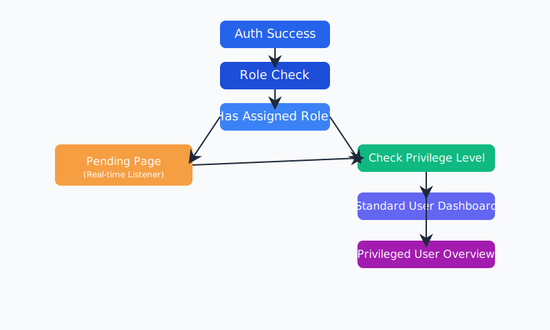

# 🧭 KBN User Journey Visualization

This document provides a professional, visual, and step-by-step overview of the user journey within the KBN platform, reflecting the latest app flow and real-time privilege management.

---

## 1. High-Level User Journey Diagram



```mermaid
flowchart TD
    A([User Authenticates]) --> B{Profile Complete?}
    B -- No --> C[Complete Profile Page\nEmployee/Visitor Type]
    C --> D{Role Assigned?}
    B -- Yes --> D{Role Assigned?}
    D -- No --> E[Pending Page\n(Real-time Listener)]
    E -- Role Assigned --> F{Privilege Check}
    D -- Yes --> F{Privilege Check}
    F -- Standard User --> G[User Dashboard]
    F -- Privileged User --> H[Overview Page]
```

---

## 2. Step-by-Step User Journeys

### 👤 New User (Pending Approval)
1. **Authentication:** User signs in via Firebase (email/password, Google, or phone).
2. **Profile Completion Check:**
   - System checks if user has completed their profile information.
   - If profile is incomplete, user is redirected to the Complete Profile page.
   - User selects their type (Employee or Visitor) and fills in required information.
   - System saves profile with role set to `PENDING`.
3. **Role Check:** System checks for assigned role in Firestore.
4. **Pending State:**
   - If role is `PENDING`, user is redirected to the Pending page.
   - A real-time Firestore listener monitors for role assignment.
   - User sees a clear message: _"Waiting for admin approval"_.
5. **Automatic Progression:**
   - Once an admin assigns a role, the listener triggers an automatic redirect to the appropriate landing page (no manual refresh required).

### 👑 Privileged User (Admin/Manager)
1. **Authentication:** User logs in.
2. **Profile Check:**
   - System verifies profile completion.
3. **Role & Privilege Check:**
   - System confirms assigned role and checks privilege level (e.g., ADMIN, SUPER_ADMIN).
4. **Access Granted:**
   - User is redirected to the Overview page.
   - Administrative dashboard and controls are available.
   - Real-time updates ensure immediate access changes if privileges are updated.

### 🙍 Standard User
1. **Authentication:** User logs in.
2. **Profile Check:**
   - System verifies profile completion.
3. **Role & Privilege Check:**
   - System confirms assigned role and checks for standard permissions.
4. **Access Granted:**
   - User is redirected to the User Dashboard.
   - Only features relevant to standard users are displayed.
   - Real-time updates ensure access is adjusted if role changes.

---

## 3. Real-Time Experience Highlights

- **Instant Feedback:** Users are always shown their current access state, with no need to refresh.
- **Automatic Redirection:** Role or privilege changes (e.g., admin approval) trigger immediate navigation to the correct page.
- **Clear Communication:** Pending users receive clear, actionable feedback about their status.
- **Security:** Users never see unauthorized content, even briefly, due to real-time privilege checks.
- **Adaptive Forms:** The profile completion form changes based on user type selection (Employee/Visitor).
- **Personalized Experience:** Profile photos and display names are used to create a personalized greeting when available.

---

## 4. User Journey Table

| Step                | New User (Pending) | Standard User      | Privileged User   |
|---------------------|--------------------|--------------------|-------------------|
| Auth Success        | ✔                  | ✔                  | ✔                 |
| Profile Check       | ✔                  | ✔                  | ✔                 |
| Complete Profile    | ✔ (if incomplete)  | ✔ (if incomplete)  | ✔ (if incomplete) |
| Role Check          | ✔                  | ✔                  | ✔                 |
| Pending Page        | ✔ (if PENDING)     |                    |                   |
| Privilege Check     |                    | ✔                  | ✔                 |
| Dashboard           |                    | ✔                  |                   |
| Overview Page       |                    |                    | ✔                 |

---

## 5. User Type-Specific Forms

### Employee Profile
- Required fields:
  - First Name
  - Last Name
  - Province (using ProvinceSelector component)
  - Branch
  - Department
  - Employee ID

### Visitor Profile
- Required fields:
  - First Name
  - Last Name
  - Phone Number (with validation)
  - Purpose of Visit

---

## 6. Best Practices in the Journey

- **Real-Time Listeners:** Ensure users are always in sync with their current privileges.
- **Progressive Disclosure:** Only show features relevant to the user's current role.
- **Graceful Handling:** Pending and unauthorized states are handled with clear UI and messaging.
- **Seamless Navigation:** All transitions are automatic and require no user intervention.
- **Responsive Forms:** Form fields dynamically update based on user selections.
- **Clear Validation:** Form validation with helpful error messages ensures data quality.
- **Visual Feedback:** Animation and transitions provide context during user journey.

---

## 7. Related Documentation

- [App Flow](./app-flow.md)
- [Authentication Flow](./authentication-flow.md)
- [Roles and Permissions](./roles-and-permissions.md)
