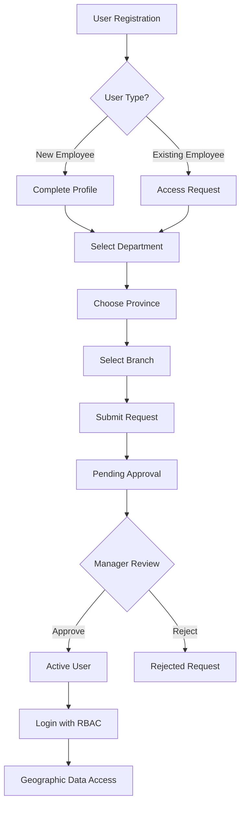

# KBN User Authentication System with RBAC Integration

## Overview

The KBN User Authentication System provides a comprehensive solution for user registration, login, and approval workflow that seamlessly integrates with the Role-Based Access Control (RBAC) and multi-province geographic system.

## Key Features

### 🚀 **Dual User Registration Types**

- **New Employee Registration**: First-time system users
- **Existing Employee Access Request**: Current employees requesting system access

### 🔒 **Integrated RBAC Security**

- Automatic role assignment based on department
- Geographic access control (province/branch)
- Permission-based authorization
- Approval workflow integration

### 🏢 **Multi-Province Support**

- Province-specific user management
- Branch-based access control
- Geographic data filtering
- Regional approval workflows

### 📱 **Modern UI/UX**

- Step-by-step registration process
- Ant Design components (replacing outdated libraries)
- Mobile-responsive design
- Intuitive approval management interface

## Architecture



## Components

### 1. Enhanced Authentication Components

#### **EnhancedSignUp** (`src/Modules/Auth/EnhancedSignUp.js`)

- 4-step registration wizard
- Real-time validation
- Department-based role assignment
- Geographic context integration

```javascript
// Step 1: User Type Selection
- New Employee Registration
- Existing Employee Access Request

// Step 2: Personal Information
- Name, Email, Password validation
- Security requirements enforcement

// Step 3: Work Information
- Province selection
- Department selection (auto-assigns access level)

// Step 4: Branch Selection
- Geographic filtering based on province
- Branch availability validation
```

#### **EnhancedLogin** (`src/Modules/Auth/EnhancedLogin.js`)

- Modern login interface
- RBAC data loading on authentication
- User status validation (approved/active)
- Geographic context initialization

### 2. User Management Components

#### **UserApproval** (`src/Modules/Admin/UserApproval/index.js`)

- Manager approval interface
- Geographic filtering for requests
- Status management (pending/approved/rejected)
- Detailed user information display

### 3. Enhanced Redux Actions

#### **Authentication Actions** (`src/redux/actions/auth.js`)

**New Functions:**

- `signUpUserWithRBAC()` - Enhanced registration with RBAC
- `loginUser()` - Updated to load RBAC data
- Automatic approval workflow creation

## Data Structure

### User Profile Structure

```javascript
{
  // Firebase Auth Data
  uid: "user_id",
  email: "user@example.com",
  emailVerified: true,

  // Profile Information
  firstName: "ชื่อ",
  lastName: "นามสกุล",
  displayName: "ชื่อ นามสกุล",

  // RBAC Fields
  accessLevel: "BRANCH_MANAGER",
  department: "sales",
  homeProvince: "นครสวรรค์",
  homeBranch: "NSN001",
  allowedProvinces: ["นครสวรรค์"],
  allowedBranches: ["NSN001"],

  // Status Fields
  isActive: true,
  isApproved: true,
  approvalStatus: "approved",
  approvedBy: "manager_uid",
  approvedAt: 1640995200000,

  // Timestamps
  created: 1640995200000,
  lastLogin: 1640995200000
}
```

### Approval Request Structure

```javascript
{
  userId: "user_id",
  requestType: "new_registration", // or "access_request"
  userData: {}, // Complete user profile
  status: "pending", // pending/approved/rejected
  targetProvince: "นครสวรรค์",
  targetBranch: "NSN001",
  department: "sales",
  accessLevel: "SALES_STAFF",
  createdAt: 1640995200000,

  // Approval Fields (when processed)
  approvedBy: "manager_uid",
  approverName: "Manager Name",
  approvedAt: 1640995200000,

  // Rejection Fields (if rejected)
  rejectedBy: "manager_uid",
  rejectorName: "Manager Name",
  rejectedAt: 1640995200000,
  rejectionReason: "Reason for rejection"
}
```

## Implementation Flow

### 1. User Registration Process

```javascript
// User fills registration form
const userData = {
  firstName: "ชื่อ",
  lastName: "นามสกุล",
  email: "user@example.com",
  password: "password",
  province: "นครสวรรค์",
  department: "sales",
  branch: "NSN001",
  isExistingUser: false,
};

// System processes registration
dispatch(signUpUserWithRBAC(userData));

// Automatic role assignment based on department
const accessLevel = getDepartmentAccessLevel(department);
// sales -> SALES_STAFF

// Geographic context setup
const geographic = {
  homeProvince: province,
  homeBranch: branch,
  allowedProvinces: [province],
  allowedBranches: [branch],
};
```

### 2. Login Process with RBAC Loading

```javascript
// User logs in
dispatch(loginUser(email, password, rememberMe));

// System loads RBAC data from Firestore
const userDoc = await firestore.collection("users").doc(uid).get();

// Merge authentication + RBAC data
const enhancedUser = {
  ...authData,
  ...rbacData,
  permissions: rbacData.permissions,
  geographic: rbacData.geographic,
};

// Validate user status
if (!userData.isApproved) {
  throw new Error("บัญชีของคุณยังไม่ได้รับการอนุมัติ");
}
```

### 3. Manager Approval Workflow

```javascript
// Manager views pending requests
const requests = await firestore
  .collection("approvalRequests")
  .where("status", "==", "pending")
  .where("targetProvince", "in", managerProvinces)
  .get();

// Approve user
const approveUser = async (requestId, userData) => {
  const batch = firestore.batch();

  // Update user status
  batch.update(userRef, {
    "auth.isActive": true,
    "auth.isApproved": true,
    "auth.approvalStatus": "approved",
  });

  // Update request status
  batch.update(requestRef, {
    status: "approved",
    approvedBy: managerId,
    approvedAt: Date.now(),
  });

  await batch.commit();
};
```

## Permission Integration

### Department-Based Access Levels

```javascript
const getDepartmentAccessLevel = (department) => {
  const mapping = {
    accounting: "ACCOUNTING_STAFF",
    sales: "SALES_STAFF",
    service: "SERVICE_STAFF",
    inventory: "INVENTORY_STAFF",
    management: "BRANCH_MANAGER",
  };
  return mapping[department] || "INVENTORY_STAFF";
};
```

### Permission Structure

```javascript
// Each access level has specific permissions
SALES_STAFF: [
  "sales.view", // View sales data
  "sales.edit", // Edit sales records
  "inventory.view", // View inventory
  "reports.view", // View reports
];

BRANCH_MANAGER: [
  "sales.view",
  "sales.edit",
  "sales.approve",
  "accounting.view",
  "accounting.edit",
  "users.manage", // Can approve users
  "reports.view",
];
```

## Geographic Access Control

### Province-Level Filtering

```javascript
// Users only see data from their allowed provinces
const query = firestore
  .collection("data")
  .where("provinceId", "in", user.allowedProvinces);
```

### Branch-Level Filtering

```javascript
// Branch staff see only their branch data
const query = firestore
  .collection("data")
  .where("branchCode", "in", user.allowedBranches);
```

## Security Features

### 1. **Automatic Data Filtering**

- All queries automatically include provinceId filter
- Users cannot access unauthorized geographic data
- Branch-level access control enforcement

### 2. **Approval Workflow**

- New users require manager approval
- Geographic-based approval routing
- Audit trail for all approvals/rejections

### 3. **Status Validation**

- Login blocked for unapproved users
- Account suspension capability
- Real-time status checking

### 4. **Permission Enforcement**

- Component-level permission gates
- API-level authorization checks
- Route protection based on RBAC

## Navigation Integration

### Route Protection

```javascript
// Protected routes require specific permissions
<LayoutWithRBAC permission="users.manage" title="User Management">
  <UserApproval />
</LayoutWithRBAC>

// Geographic context automatically available
<LayoutWithRBAC permission="sales.view" autoInjectProvinceId={true}>
  <SalesComponent />
</LayoutWithRBAC>
```

### Menu Access Control

```javascript
// Navigation items filtered by permissions
const { hasPermission } = usePermissions();

{
  hasPermission("users.manage") && (
    <Menu.Item key="user-approval">
      <Link to="/admin/user-approval">User Approval</Link>
    </Menu.Item>
  );
}
```

## Benefits

### 🔒 **Enhanced Security**

- Zero data leakage between provinces/branches
- Role-based permission enforcement
- Comprehensive audit trail

### ⚡ **Improved Performance**

- Geographic filtering at database level
- Smaller result sets
- Optimized queries

### 🛠️ **Better Developer Experience**

- Consistent RBAC patterns
- Automatic geographic injection
- Clear permission structure

### 👥 **Superior User Experience**

- Intuitive registration process
- Clear approval workflows
- Relevant data presentation

## Migration from Legacy System

### Old vs New Comparison

| Legacy System           | New Enhanced System                 |
| ----------------------- | ----------------------------------- |
| Manual role assignment  | Automatic department-based roles    |
| No geographic filtering | Automatic province/branch filtering |
| Basic authentication    | Full RBAC integration               |
| Material-UI components  | Modern Ant Design components        |
| Single approval flow    | Dual registration types             |
| No audit trail          | Comprehensive logging               |

### Migration Steps

1. **Update Authentication Components**

   - Replace old Login/SignUp with Enhanced versions
   - Update Auth Redux actions

2. **Add User Management Routes**

   - Create UserApproval management interface
   - Add permissions for user management

3. **Update Permission Structure**

   - Add user management permissions
   - Integrate geographic access control

4. **Deploy Approval Workflow**
   - Create approval request collections
   - Set up manager notification system

## Future Enhancements

### Planned Features

- Email notifications for approval status
- Bulk user approval capabilities
- Advanced user search and filtering
- Role transfer workflows
- Self-service profile updates
- Two-factor authentication
- Password complexity policies
- Session management controls

### Integration Opportunities

- HR system integration
- Active Directory sync
- Single sign-on (SSO)
- Mobile app authentication
- API key management

---

**Status**: ✅ **COMPLETED** - Production Ready
**Next Phase**: Systematic deployment across all modules
**Documentation**: Complete with examples and best practices
